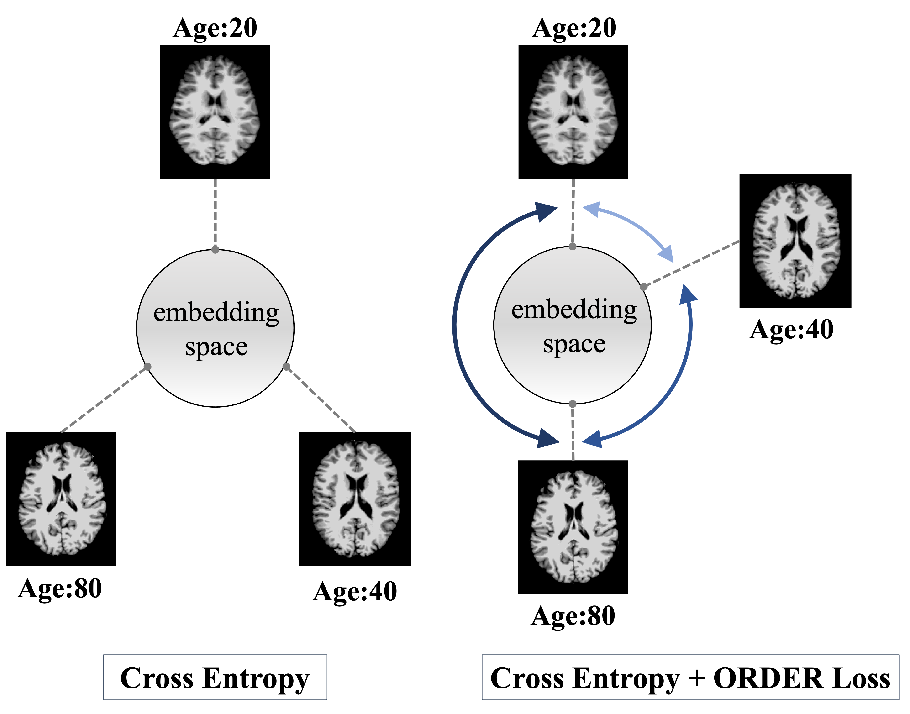
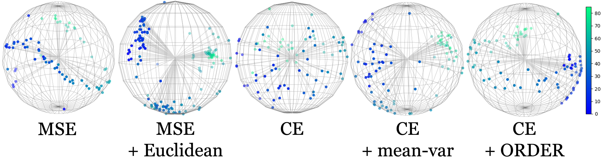

# Robust Brain Age Prediction

Official PyTorch implementation of [**Ordinal Classification with Distance Regularization for Robust Brain Age Prediction**](https://openaccess.thecvf.com/content/WACV2024/html/Shah_Ordinal_Classification_With_Distance_Regularization_for_Robust_Brain_Age_Prediction_WACV_2024_paper.html) [WACV 2024][[Preprint]](https://arxiv.org/abs/2403.10522)

[Jay Shah](https://www.public.asu.edu/~jgshah1/)<sup>1,2</sup>,
[Md Mahfuzur Rahman Siddiquee](https://mrahmans.me/)<sup>1,2</sup>
[Yi Su](https://scholar.google.com/citations?user=vdZKSEIAAAAJ&hl=en)<sup>1,2,3</sup>,
[Teresa Wu](https://labs.engineering.asu.edu/wulab/person/teresa-wu-2/)<sup>1,2</sup>
[Baoxin Li](https://www.public.asu.edu/~bli24/)<sup>1,2</sup>

<sup>1</sup>ASU-Mayo Center for Innovative Imaging,
<sup>2</sup>Arizona State University,
<sup>3</sup>Banner Alzheimer’s Institute

## Abstract 
Age is one of the major known risk factors for Alzheimer's Disease (AD). Detecting AD early is crucial for effective treatment and preventing irreversible brain damage. Brain age, a measure derived from brain imaging reflecting structural changes due to aging, may have the potential to identify AD onset, assess disease risk, and plan targeted interventions. Deep learning-based regression techniques to predict brain age from MRI scans have shown great accuracy recently. However, these methods are subject to an inherent regression to the mean effect, which causes a systematic bias resulting in an overestimation of brain age in young subjects and underestimation in old subjects. This weakens the reliability of predicted brain age as a valid biomarker for downstream clinical applications. Here, we reformulate the brain age prediction task from regression to classification to address the issue of systematic bias. Recognizing the importance of preserving ordinal information from ages to understand aging trajectory and monitor aging longitudinally, we propose a novel **ORdinal Distance Encoded Regularization (ORDER)** loss that incorporates the order of age labels, enhancing the model's ability to capture age-related patterns. Results and ablation studies demonstrate that this framework:</br></br>
		➡ Reduces systematic bias in predictions</br> 
		➡ Outperforms SOTA methods</br>
		➡ Can better capture subtle differences between clinical groups (Alzheimer's Disease)</br>

<p align="center">

</p>
<p align="left">
<em>Cross entropy encourages the model to learn high entropy feature representations where embeddings are spread out, but fails to capture ordinality from labels. ORDER loss + cross entropy preserves ordinality by spreading the features proportional to Manhattan distance between normalized features weighted by absolute age difference.</em>
</p>

<p align="center">

</p>
<p align="left">
<em>t-SNE visualization of embeddings from models’ penultimate layer using different loss functions.</em>
</p>

## Installation
Instructions to install MONAI can be found [here](https://docs.monai.io/en/stable/installation.html) and the appropriate version of Pytorch using [locally](https://docs.monai.io/en/stable/installation.html).
Packages used in the current version of this code.
```
monai==1.3.0
torch==2.1.0+cu118
torchaudio==2.1.0+cu118
torchmetrics==1.2.0
torchvision==0.16.0+cu118
tensorboard==2.14.1
tensorflow==2.14.0
```
## Dataset
Use `age_binning.py` to create the data folds. You should structure your aligned dataset in the following way:
```
data/HC/
  ├── train
  	├──xxx.nii
	├──...
  ├── val
  	├──yyy.nii
	├──...
  ├── test
  	├──zzz.nii
	├──...
```
## Training 
```
python3 train.py --dataset data --batch_size 4 --losses ce order --model_name resnet18 --ld 0.1
```
## Results 
Methods		      | MAE   | Ordinality| SB-L	| SB-R
------------------| :----:|:---------:|:-----:|:----:
MSE  			  | 3.93  |0.99		  |3.4	  |-4.2
MSE + Euclidean   | 4.57  |0.95		  |4.8	  |-4.1
CE  			  | 3.33  |0.31		  |1.1	  |-3.6
CE + mean-variance| 2.65  |0.58		  |0.4	  |-4.2
CE + ORDER  	  | **2.56**	|**0.98**		|**0.1**	|**-2.5**

## Citation
Please consider citing this work if this repository is useful for your work. 
```
@inproceedings{shah2024ordinal,
  title={Ordinal Classification With Distance Regularization for Robust Brain Age Prediction},
  author={Shah, Jay and Siddiquee, Md Mahfuzur Rahman and Su, Yi and Wu, Teresa and Li, Baoxin},
  booktitle={Proceedings of the IEEE/CVF Winter Conference on Applications of Computer Vision},
  pages={7882--7891},
  year={2024}
}
```
## Acknowledgments
This research received support from the National Institute on Aging (NIA) of the National Institutes of Health (NIH) under Award Numbers R01AG069453, P30AG072980, RF1AG073424, Banner Alzheimer’s Foundation and the Arizona Department of Health Services to Arizona Alzheimer’s Research Center.
